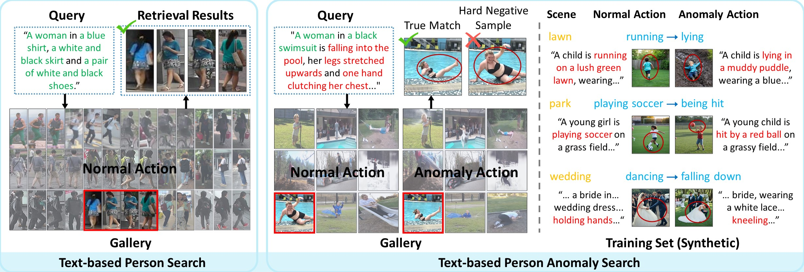
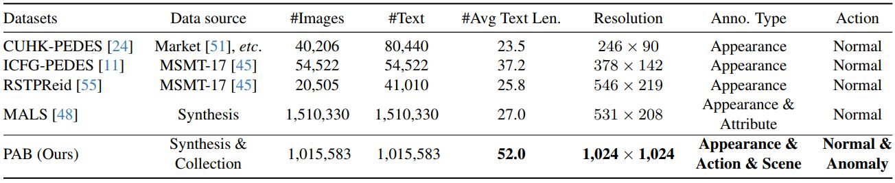
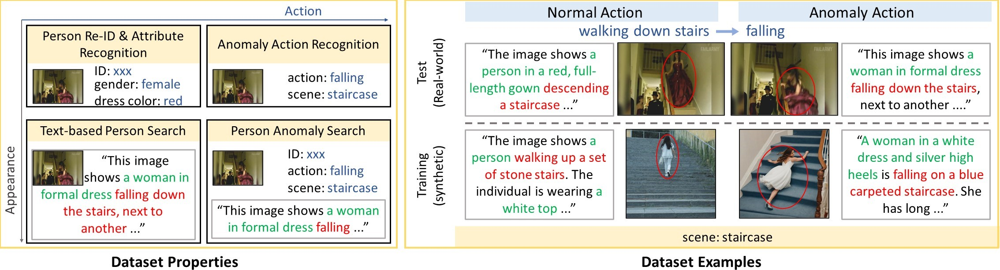
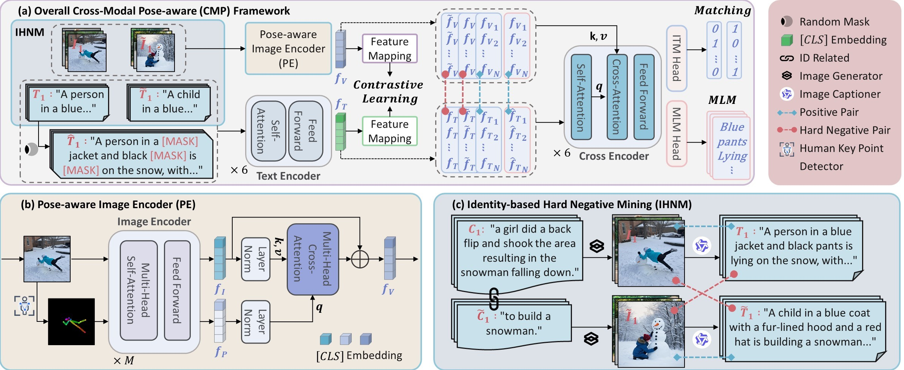

# CMP: Cross-Modal Pose-aware framework for Text-based Person Anomaly Search


**[Beyond Walking: A Large-Scale Image-Text Benchmark 
for Text-based Person Anomaly Search](https://arxiv.org/abs/2411.17776). 
Shuyu Yang, Yaxiong Wang, Li Zhu, Zhedong Zheng. arXiv 2024.**


- CMP and Attribute annotation is coming soon
- Dec 2024: Release Baseline code and PAB dataset
- Nov 2024: Release preprint in [arXiv](https://arxiv.org/abs/2411.17776)


We introduce the **task** of **Text-based Person Anomaly Search**, 
which aims to locate pedestrians engaged in both routine and anomalous 
activities using natural language descriptions. Given the lack of a 
**dataset** in this field, we construct the **P**edestrian **A**nomaly 
**B**ehavior (**PAB**) benchmark, featuring **1, 013, 605** synthesized 
and **1, 978** real-world image-text pairs with a broad spectrum of 
actions and anomalies.

This is the comparison of our proposed task, i.e., Text-based Person Anomaly Search (right) vs. Traditional Text-Based Person
Search (left). 
<div align="center"></div>


We propose a **C**ross-**M**odal **P**ose-aware (**CMP**) framework that 
integrates human pose patterns with identity-based hard negative pair 
sampling to enhance the discrimination between normal and anomalous behaviors. 
This framework leverages structural information from human poses 
to improve the understanding of pedestrian activities, 
leading to better retrieval performance.

Extensive experiments on the PAB benchmark show that synthetic training data 
effectively facilitates fine-grained behavior retrieval in real-world 
test sets. Our pose-aware method further improves recall@1 by +2.88%, 
highlighting its effectiveness in identifying anomalous behaviors.
More details can be found at our paper: 
[Beyond Walking: A Large-Scale Image-Text Benchmark 
for Text-based Person Anomaly Search](https://arxiv.org/abs/2411.17776)


## PAB
PAB leverages generative models to generate a large-scale dataset including 
1𝑀 image-text pairs. Each image-text pair in PAB is annotated with 
action and scene attribute, indicating that PAB is not only effective 
for Text-based Person Anomaly Search, but also supports 
future attribute recognition tasks like action or scene classification.
The dataset is released at 
[OneDrive](https://1drv.ms/f/c/afc02d7952f9b34d/Epb3qCEwsMJOjYIx-sMm_rkBbZfyiD8I-bRmLp0X-rT1vQ?e=7gyGco) 
& [Baidu Yun](https://pan.baidu.com/s/1gqY6DuTL-EStXlH0dz05ng) [mdjb].

**Note that PAB can only be used for research, any commercial usage is forbidden.**

This is the comparison between PAB and other text based person search datasets. 
<div align="center"></div>
These are dataset properties and examples of PAB.
<div align="center"></div>

Annotation format:

```
{"image": "train/imgs_0/goal/0.jpg", 
"caption": "The image shows a band performing on stage under a large tent...", 
"image_id": "0_0", 
"hard_i": "imgs_0/full/0.jpg", 
"hard_c": "The image shows a band performing under a large white tent...", 
"hard_i_id": "0_8954", 
"source_id": "1_0", 
"source_caption": "band was performing under a big tent", 
"normal": "Performing", 
"scene": "outdoor concert"}
...
{"image": "train/imgs_0/full/6667.jpg", 
"caption": "The image shows a person running on a grassy field...",
"image_id": "0_13630", 
"hard_i": "imgs_0/goal/6736.jpg", 
"hard_c": "The image shows a person running on a grassy field.",
"hard_i_id": "0_5077", 
"source_id": "3617_2", 
"source_caption": "...he kept falling to the ground", 
"anomaly": "Falling", 
"scene": "Lawn"
...
```

## Models and Weights

This is Overview of our Cross-Modal Pose-aware (CMP) framework. 
<div align="center"></div>

[//]: # (The checkpoints `baseline.pth` and training log have been released at)
[//]: # ([Google Drive]&#40;&#41;.)


## Usage

### Install Requirements

We use 4 NVIDIA GeForce RTX 3090 GPUs (24G) for training and evaluation.

Create conda environment.

```
conda create -n cmp python=3.10
conda activate cmp
pip install torch==2.2.0 torchvision==0.17.0 torchaudio==2.2.0 --index-url https://download.pytorch.org/whl/cu118
pip3 install -r requirements.txt
```

For the first time you use wordnet
```
python
>>> import nltk
>>> nltk.download('wordnet')
```

### Parameter Initialization

Download pre-trained models for parameter initialization:

Initializing parameters from text-based person search pretrained model: 
[pretrained.pth](https://drive.google.com/file/d/1KffesfZD45kOQH2E4G31Sd3rbj9djD3d/view?usp=sharing)

or initializing image encoder: 
[swin-transformer-base](https://github.com/SwinTransformer/storage/releases/download/v1.0.0/swin_base_patch4_window7_224_22k.pth) 
& text encoder: [bert-base-uncased](https://huggingface.co/bert-base-uncased/tree/main) separately.

Organize `checkpoint` folder as follows:

[//]: # (|    |-- baseline.pth)

```
|-- checkpoint/
|    |-- pretrained.pth
|    |-- bert-base-uncased/
|    |-- swin_base_patch4_window7_224_22k.pth
```

### Datasets Prepare

And organize PAB in `../data/PAB` folder as follows:

```
|-- PAB/
|    |-- annotation/
|        |-- train/
|            |-- pair_0.json
|            |-- ...
|        |-- train_attr/
|            |-- attr_0.json
|            |-- ...
|        |-- test/
|            |-- pair.json
|            |-- attr.json
|        |-- source_caption.json
|    |-- train/
|        |-- imgs_0/
|            |-- goal/
|                |-- 0.jpg
|                |-- ...
|            |-- wentrong/
|            |-- full/
|        |-- imgs_1/
|        |-- ...
|    |-- test/
|        |-- 0.jpg
|        |-- ...
|    |-- pose/
|        |-- train/
|            |-- imgs_0/
|            |-- ...
|        |-- test/
```

### Training
We train Baseline using PAB as follows：

```
python3 run.py --task "baseline" --dist "f4" --output_dir "output/baseline"
```

[//]: # (### Evaluation)

[//]: # ()
[//]: # (```)

[//]: # (python3 run.py --task "baseline" --evaluate --dist "f4" --output_dir "output/baseline_eval" --checkpoint "checkpoint/baseline.pth")

[//]: # (```)

## Reference
If you use PAB or CMP in your research, please cite it by the following BibTeX entry:

```
@article{yang2024beyond,
  title={Beyond Walking: A Large-Scale Image-Text Benchmark for Text-based Person Anomaly Search},
  author={Yang, Shuyu and Wang, Yaxiong and Zhu, Li and Zheng, Zhedong},
  journal={arXiv preprint arXiv:2411.17776},
  year={2024}
}

```
